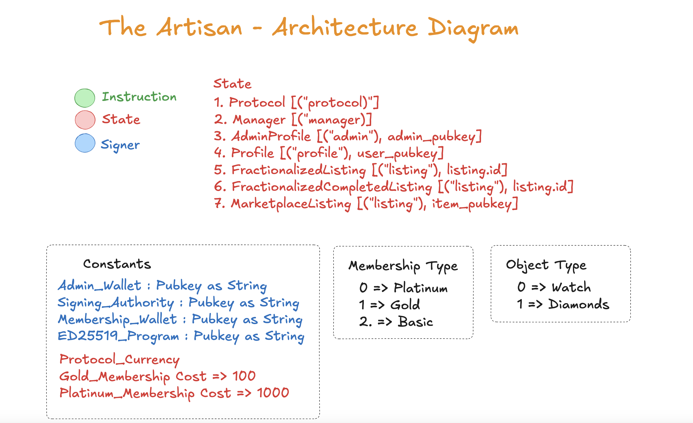
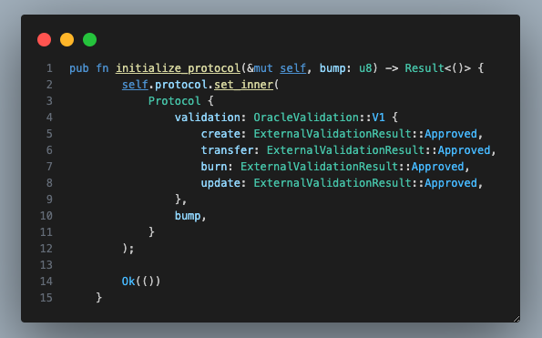
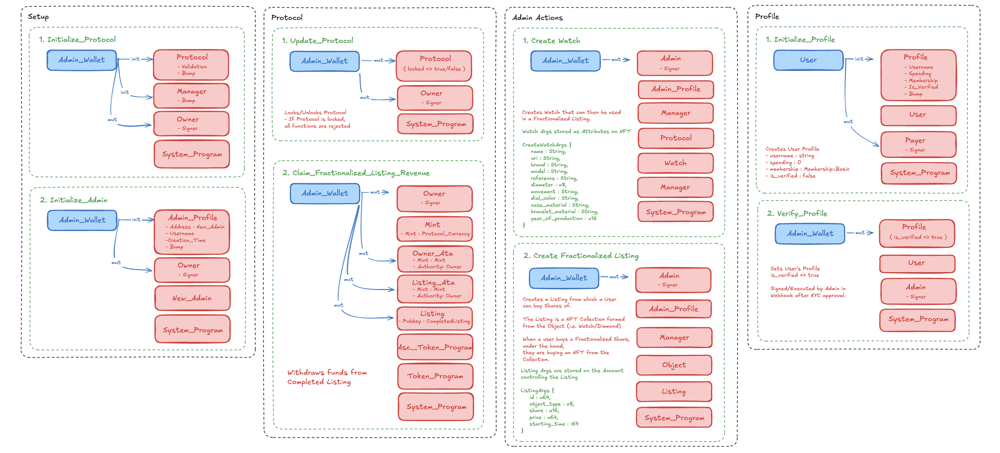
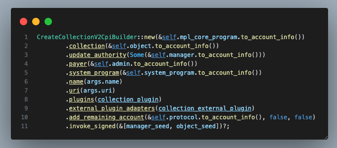
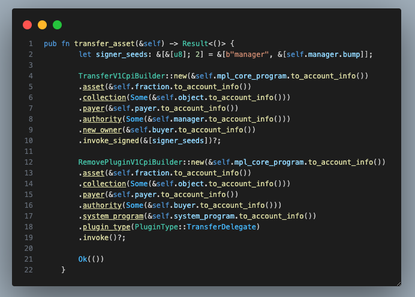

# The Artisan - Real World Assets on Solana

The Artisan is a RWA marketplace where users can buy fractionalized shares of luxury assets backed by Metaplex's Core NFT's. With our custom Solana Program, Artisan Protocol, we are able to ensure all regulatory compliances are met while providing access to Luxury Assets at an affordable price.

[Pitch Deck](https://docsend.com/view/jf8ghnmzucag9arf)

[Demo Video](https://youtu.be/A1LGPReFXtM)

## Table of Contents

- [Overview](#overview)
- [Architecture](#architecture)
  - [Frontend Architecture](#frontend-architecture)
  - [Backend Services](#backend-services)
  - [Blockchain Integration](#blockchain-integration)
- [Features](#features)
  - [Web3Auth](#web3auth)
  - [Stripe Pay](#stripe-pay)
- [Solana Program](#solana-program)
  - [Overview](#program-overview)
  - [Metaplex Core](#metaplex-core)
- [Getting Started](#getting-started)
- [Development](#development)
- [Team](#team)
- [License](#license)

## Overview

The Artisan is a next-generation marketplace that bridges traditional luxury assets with blockchain technology. Our platform enables fractional ownership of high-value assets through a combination of regulatory-compliant NFTs and user-friendly interfaces.

## Architecture

### Frontend Architecture

The application is built using a modern tech stack:
- **Next.js 14**: App Router architecture for server-side rendering and optimal performance
- **TypeScript**: For type-safe development
- **TailwindCSS**: For responsive and maintainable styling
- **Radix UI**: For accessible component primitives
- **Apollo Client**: For efficient GraphQL data management
- **Zustand & Jotai**: For state management
- **React Three Fiber**: For 3D asset visualization

### Backend Services

The platform utilizes several backend services:
- **MongoDB**: For user data and asset metadata storage
- **AWS S3**: For asset image and media storage
- **GraphQL API**: For efficient data querying and mutations
- **Stripe**: For traditional payment processing

### Blockchain Integration

- **Solana Integration**: Built with @solana/web3.js and @coral-xyz/anchor
- **Web3Auth**: For seamless web2 to web3 user onboarding
- **Metaplex**: For NFT standard compliance and marketplace integration

## Features

- Custom Solana Program to facilitate minting and distribution of Metaplex Core NFTs

https://github.com/user-attachments/assets/9767b59a-1be8-4374-8761-b69043accb8b

- Custom off-chain Database to manage asset and user details necessary for compliance

https://github.com/user-attachments/assets/a472db25-758a-46df-8e64-cbe3f1e6cfa0

- Access Luxury Collections to purchase, trade, and sell fractions of available assets

https://github.com/user-attachments/assets/90dfa189-b88b-45e6-922b-932c5924e538

- Track your assets via an intuitive User Dashboard
- Refer friends to earn points and rewards

### Web3Auth

Use your Email as a wallet and pay using Stripe or Crypto. With Web3Auth integration, users can easily access their Artisan Profile from any browser and while securely maintaining their wallet. With this feature we aim to make the transition to The Artisan simple for Web 2 native investors.

https://github.com/user-attachments/assets/1236d84e-80f2-46c5-9e1e-21cb35b5b105

### Stripe Pay

Not familiar with crypto? No problem! Our custom Solana Program utilizes the `ED25519_PROGRAM_ID` to securely process a Stripe Checkout session to verify purchase and bypass the standard token transfer.

Under the hood our program checks for specific signers and messages to verify the transaction is legit and processed.


## Solana Program

## Program ID
| Cluster      | Program Id |
| :---        |    :----:   |
| **Localnet**     | `s8TwaQ8iKA4NPRgeSEGJfajD4hZAvriK5xisz82yBbU` |
| **Devnet**  | `s8TwaQ8iKA4NPRgeSEGJfajD4hZAvriK5xisz82yBbU` |
| **Mainnet**  | `coming soon`  |

Our Solana Program is currently deployed on Devnet and under testing within our community. Our aim is to launch on mainnet by 2025.

### Overview

The custom program uses a variation of accounts to faciliate all actions. With the `Protocol` account using Metaplex Core's `OracleValidation` we can secure the protocol with one function call, rendering it useless in the case of a breach.





The Artisan Protocal is strategically structured in a modular way to ensure proper functionality in a secure manner. By breaking down the actions into a scope based role, we are able to easily upgrade the program without requiring a total refactor.



With our Marketplace Listing functionality we are able to create an in-house marketplace for users to resell their fractions, allowing us to further use Metaplex Core for royalty collections and ensure buyers are adhering to all legal rules.


### Metaplex Core

With Metaplex Core we are able to dynamically create any Luxury Asset into a fractionalized RWA, and with plugins we can ensure KYC has been completed when user's approach the legal limit. When a user buys a fraction they are minting from the Object's Metaplex's verified collection, allowing us to not onlly resell on our in-house marketplace, but in 3rd parties such as Tensor and MagicEden.





## Getting Started

1. **Prerequisites**
   - Node.js 18+ 
   - pnpm (recommended) or npm
   - Solana CLI tools
   - MongoDB instance

2. **Environment Setup**
   ```bash
   cp .env.example .env.local
   # Configure your environment variables
   ```

3. **Installation**
   ```bash
   pnpm install
   ```

4. **Development**
   ```bash
   pnpm dev     # Start development server
   pnpm build   # Production build
   pnpm start   # Start production server
   pnpm lint    # Run linting
   pnpm format  # Format code
   ```

## Development

### Code Structure
- `/app/*` - Next.js 14 app router pages and layouts
- `/components/*` - Reusable UI components
- `/hooks/*` - Custom React hooks
- `/providers/*` - Context providers
- `/lib/*` - Utility functions and configurations
- `/types/*` - TypeScript type definitions
- `/graphql/*` - GraphQL schemas and operations

### Key Workflows

1. **User Authentication**
   - Email/Social login via Web3Auth
   - Wallet connection options
   - KYC verification flow

2. **Asset Management**
   - Asset creation and verification
   - Fractionalization process
   - Marketplace listing

3. **Purchase Flows**
   - Stripe payment integration
   - Crypto payment processing
   - Fraction minting and distribution

4. **Security Considerations**
   - Multi-signature requirements
   - KYC/AML compliance
   - Regulatory checks

## Team

- Renato Capizzi - CEO & Founder
- Leonardo Donatacci - CTO and Metaplex Community Dev
- Matt Weichel - Lead Developer

## License

See the [LICENSE.md](LICENSE.md) file for details.
